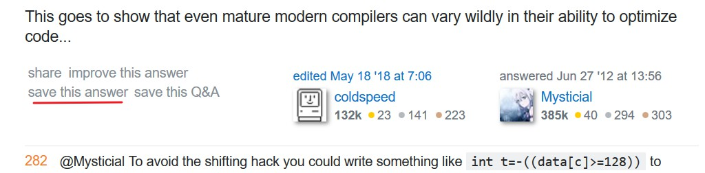
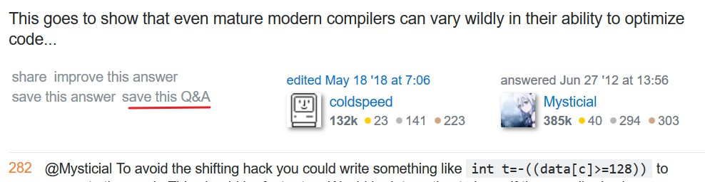
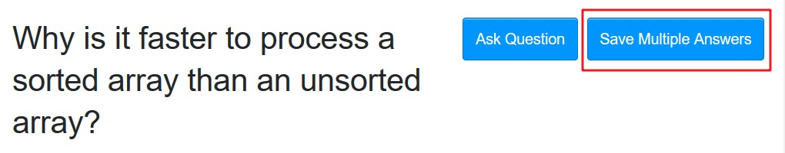
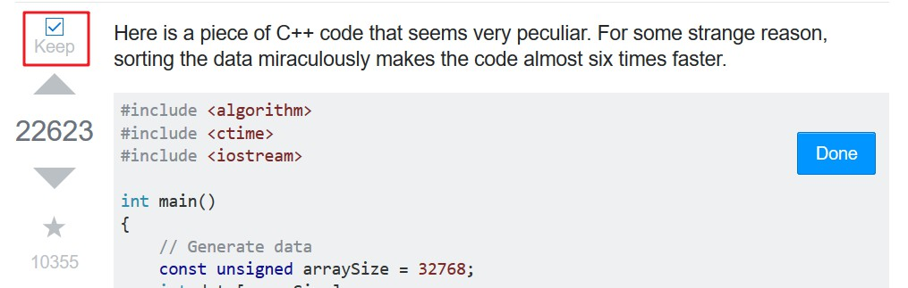
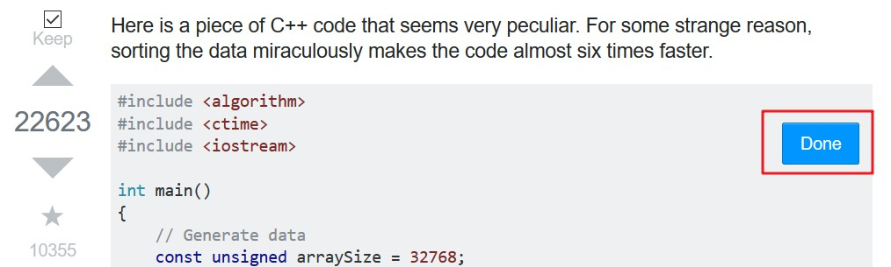

This is a user-script to reformat the contents on [Stack Exchange websites](https://stackexchange.com/sites) like [Stack Overflow](https://stackoverflow.com), so that you can use [Evernote Web Clipper](https://evernote.com/features/webclipper) to save only the contents you need, discarding irrelevant parts.

It has the following features.

1. **Save a particular answer.**
   Click the "save this answer" link at the bottom left of the answer.
   

2. **Save a particular answer along with the problem description.**
   Click the "save this Q&A" link at the bottom left of the answer.
   

3. **Save multiple answers, optionally along with the problem description.**
   1. Click the "Save Multiple Answers" button besides the "Ask Question" button.
      
   2. For each question or answer you want to save, select the checkbox above the corresponding vote buttons.
      
   3. When you have selected all the posts you want to save. Click the "Done" button floating to right of the page.
      

Then you can use [Evernote Web Clipper](https://evernote.com/features/webclipper) to save the page to [Evernote](https://evernote.com).